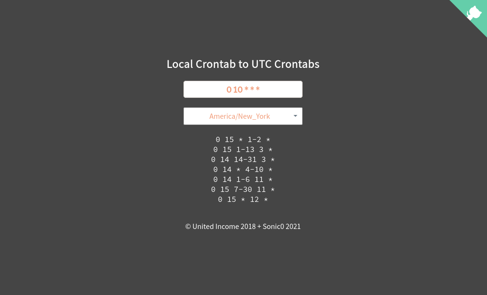

# local-crontab-web-converter
Convert localized crontab to UTC crontabs via simple web page.

## Other info
This repo is part of my Cron-Converter projects group.
Its related repositories:

- [cron-converter](https://github.com/Sonic0/cron-converter)
- [local-crontab](https://github.com/Sonic0/local-crontab)
- [local-crontab-ansible-filter](https://github.com/Sonic0/local-crontab-ansible-filter)
- [local-crontab-serverless-infrastructure](https://github.com/Sonic0/local-crontab-serverless-infrastructure)